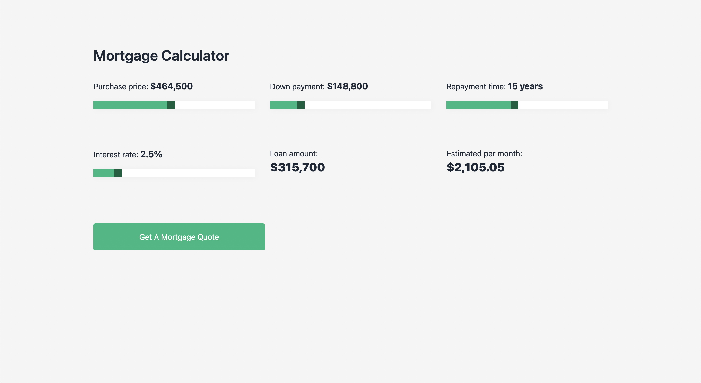

# DevProjects - Mortgage calculator web app

This is an open source project from [DevProjects](http://www.codementor.io/projects). Feedback and questions are welcome!
Find the project requirements here: [Mortgage calculator web app](https://www.codementor.io/projects/web/mortgage-calculator-web-app-d16bqrq2q3)

## Tech/framework used

Built with React.js, react-number-format and tailwindcss.

## Screenshots and demo

## Installation

Clone project git clone https://github.com/slroberts/mortgage-calculator.git

Install npm and yarn add-ons npm install and yarn install

Run project yarn start

Open your browser and enter path localhost:3000

## License

[MIT](https://choosealicense.com/licenses/mit/)
Most open source projects use the MIT license. Feel free to choose whichever license you prefer.
